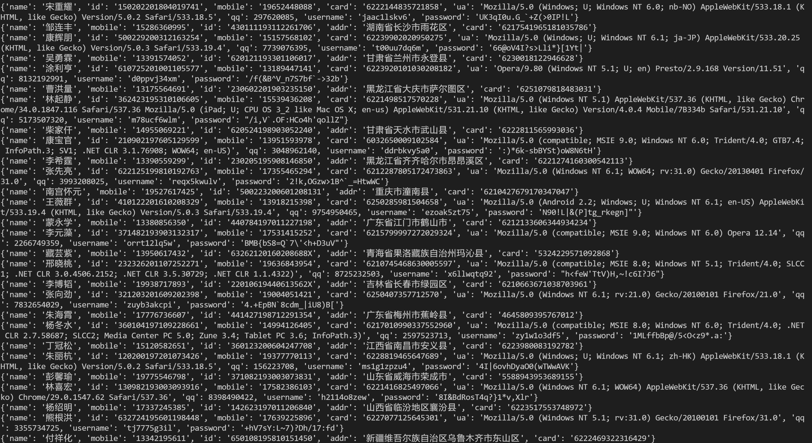

# fAKe Chinese

生成一个现实中不存在的随机 `+86` 身份.

不是社工库!

#### Done

身份证号码 (含属地)

手机号码 (含运营商)

银行账户 (含银行和账户种类)

user-agent

用户名 (ASCII)

密码 (ASCII)

QQ号

#### To Do

合并来自GOV的**公开**数据库;

支持邮箱生成;

对用户名和密码等进行封装;

用户名以 `Pin_yin` 为主;

统计用户名和密码的长度和复杂度,以自动动态调整;

用户名的长度和复杂度与密码成正比;

邮箱使用广度与密码的长度和复杂度成反比:
    个人自建 > 国际小众 (Proton Mail) > 国际大众 (Gmail, Outlook, 部分非个人邮箱) > 国产 (QQ, 126) > 部分非个人邮箱.
